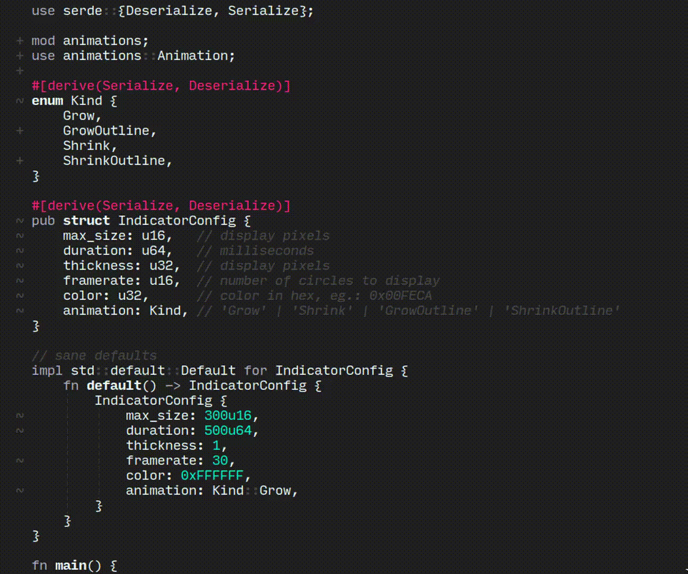

# xcursorlocate

> cursor location indicator for x11 



### install

to build `xcursorlocate`, you require the `libxcb-devel`
package (please follow [these](https://www.rust-lang.org/tools/install) instructions to install `cargo` and `rust`).  

```shell
# from crates.io
$ cargo install xcursorlocate

# from github
$ git clone https://github.com/nerdypepper/xcursorlocate
$ cd xcursorlocate
$ cargo install --force --path ./

# make sure to add ~/.cargo/bin to your $PATH
```

### usage

have your window manager trigger `xcursorlocate` on a key
press, i use `sxhkd` to handle key bindings:  
```shell
# ~/.config/sxhkd/sxhkdrc
ctrl + Escape:
    xcursorlocate
```

### configuration

`xcursorlocate` is configured via a `.toml` file, which is
present in `$XDG_CONFIG_HOME/xcursorlocate`. a basic config
is generated on first run, a sample config can be found in
the [`examples`](./examples/sample_config.toml) directory
(may not always be up to date).

### uninstall

:(

```
# using cargo
$ cargo uninstall xcursorlocate

# manually
$ rm -rf xcursorlocate/
$ rm -rf ~/.config/xcursorlocate/
$ rm -f $HOME/.cargo/bin/xcursorlocate
```

### todo:

 - use `xrender` for smooth circles
 - use opengl for fancy fx maybe?
 - add interface
 - ~~toml config~~
